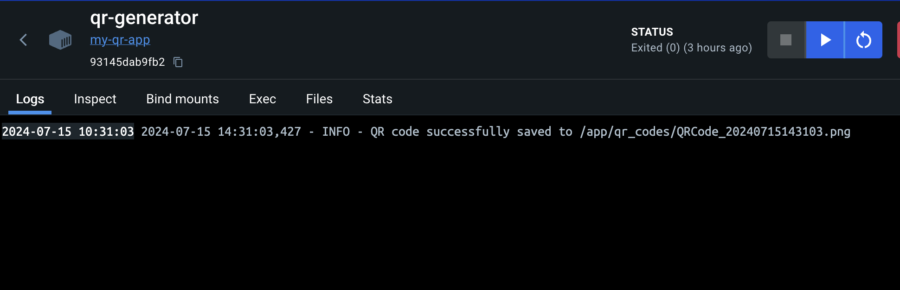

Assignment 7.

SCOPE:
created a container in docker images and generated a QR code. 
1. Added QR code to readme.md file.
2. Adding Log of the docker container.

This is my QR Code:

Adding Docker log:

